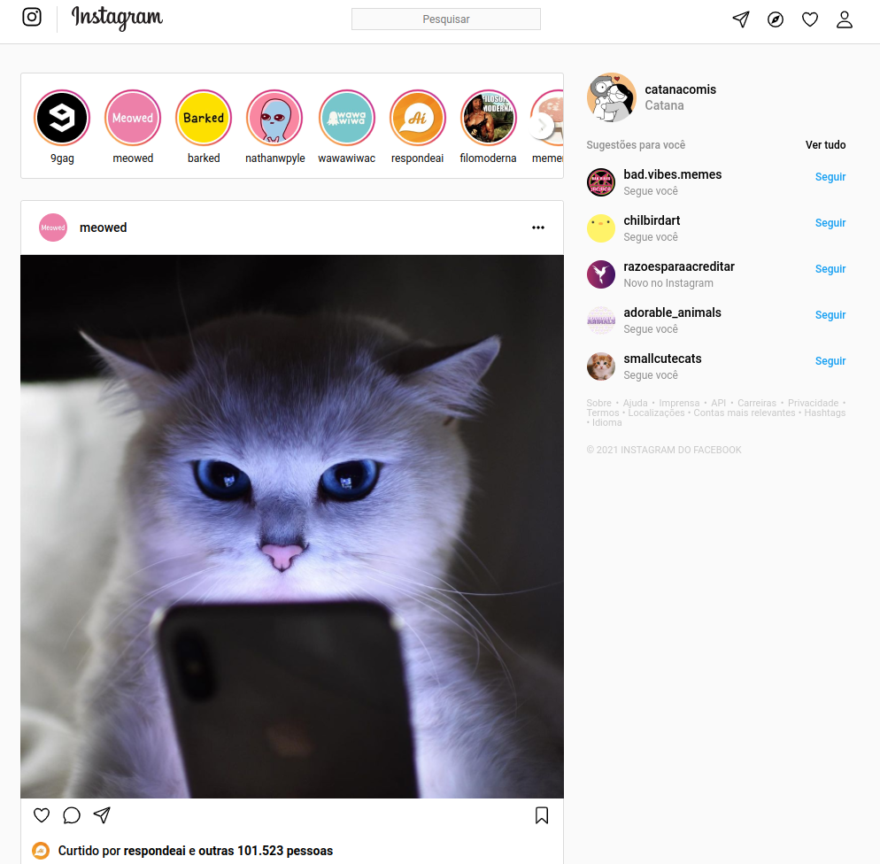

  <h1>INSTAGRAM</h1>

 
  
- Criação do front-end estático da página principal do Instagram
   
- Responsividade para todos os tamanhos de tela
   

# Tecnologias 
- 
- 
- 
- 
- 
- 
- 
- 

# Preview

  
   
   
  
Clique na imagem para acessar a página

 